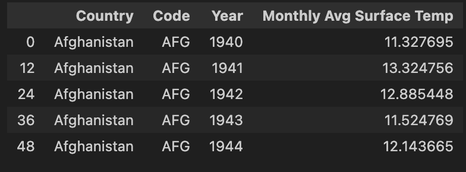
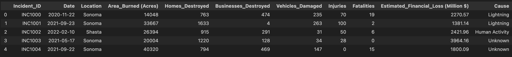
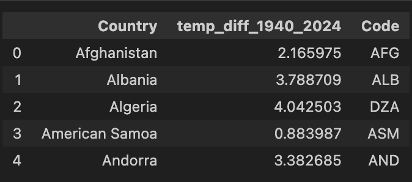

# Syn1 Final Project -- Visualization of Climate Crisis

by Coco Sun (zihansun@ucsd.edu)

## Overview
This report is going to discuss climate changes through visualizations of statistics obtained from several datasets found in Kaggle website. It includes descriptions of the overall process writing this final project, three plots, and analysis of the plots. To see the complete code that generate the plots, here is the link to the ipynb file: [link to the ipynb file](final_proj.ipynb). 


## Introduction 
Inspired by articles such as *"101: Breaking Down Greenhouse Gases"*[^1] that provide statistics of global warming, I want to dig deeper into the numbers through finding and exploring datasets from Kaggle about climate to visualize its impact. 

I would primarily focus on two datasets. 
The first dataframe `Average Monthly surface temperature (1940-2024)`[^2] provides information about the change of global surface temperature from 1940 to 2024. 

The dataframe after cleaning and re-organizing contains 16575 rows and 4 columns, with the first 5 rows presented below:




Then examining closer to relevant events, I would analyze the dataset `California Wildfire Damage (2014-(fed)2025)`[^3], with a help of another dataset `California cities dataset`[^4] to map out the locations where the wildfires have happened. 

The dataframe of `California Wildfire Damage (2014-(fed)2025)` contains 100 rows and 11 columns in which each row presents a wildfire happening betwen 2014 and 2025, and again the first 5 rows is presented below:




In the following sections, I would create three visualizations to show the impact of the climate change using the dataframe introduced above. 


## Global Warming through Global Surface Temperature

While we've learned in class that "temperature" is an important indication of global warming, surface temperature is never mentioned as an major consequence of climate change and also essential and relevant to our daily life. Surface temperature is the measure of temperature from the ground, and an increasing in surface temperature would lead to increase in sea levels, change in rainfall patterns, as well as damage to the farming systems. 

From the choropleth map below, we could detect  slight changes of surface temperature over 1940 and 2024. The lighter and darker color refers to lower and higher surface temperature correspondingly. 

<iframe
    src="assets/choropleth_avg_temp.html"
    width="800"
    height="600"
    frameborder="0"
></iframe>


To better examine the trend of increase, we can directly calculate the surface temperature difference from 1940 to 2024. 

In the dataframe `temp_diff`, each row is a country and its corresponding surface temperature difference in the 40 years. The column `Code` is included to generate the scatter plot later. 




Then we create a 3D scatter plot based on the information in the `temp_diff` dataframe:

<iframe
    src="assets/scatter3D_temp_diff.html"
    width="800"
    height="600"
    frameborder="0"
></iframe>

The 3D scatter plot is an interesting visualization to see the surface temperature change, which includes interactive designs that allows users to rotate and zoom into the plot. Each dot presents the value of surface temperature change corresponds to the location of the country, and same as before darker color implies greater increase of surface temperature. 

As you can see from the scale on the right, all values plotted are above 0, meaning that globally we are experiencing an increase in surface tempearture. 

To look into more details in the dataframe, the minimum and maximum of surface temperature change is:

```py
print(temp_diff['temp_diff_1940_2024'].min())
```


```py
print(temp_diff['temp_diff_1940_2024'].max())
```


Additionally, the surface temperature change in USA is about 2.7 as you can see from the plot. 


## Climate Change Around Us: Wildfires in California

Inspired by words professor Hayhoe in her presentation *From Global Change to Local Action*[^5], in this section I am going to consider events that are more relavant to us, by examining the frequency of wildfires in California. 

Recall the dataset `wildfires_cali`[^3] contains (incomplete) information about wildfires happening in california from 2014 and 2025. In order to visualize the frequency of wildfires each year on a scatter map, I merged the `wildfires_cali` with `California cities dataset`[^4], so that we could see boundaries of cities in California. 

This is an overview of `California cities dataset`[^4], as named    `cali_lat_lon`, each row includes information for specific location of California cities. It is neceessary to generate the scatter plot that maps the bounddaries of cities. 


Then we can generate the scatter plot:

<iframe
    src="assets/wildfires_cali.html"
    width="800"
    height="600"
    frameborder="0"
></iframe>

As shown in the scatter plot, the dots represent events of wildfire happening at the specific locations, and the size of the dots is proportional to the area burned measured in acres. The plot is also interactive so that users can drag to any directions to see other locations, or hover on the dot to see the more specific information of the fire, including the cause, the year it happened, and the area it affected. 

The bar at the bottom allows animations to see the frequecies of wildfires in each year from 2014 to 2023. In 2014, `wildfires_cali`[^3] documents four fires, scattered in different places in California and affected relatively small regions of area. Starting from 2018 to 2023, the fires begin to concentrate more near Los Angeles and also have dots in larger size with some affected area overlapped.

The scatter plot alone may not be a powerful evidence to show the tendency for an increase in frequency and seriesness of the wildfire in recent years. But its indication for wildfires to occur more densely and to broadly impact should alarm us of the progressing of climate change. Moreover, the dataset itself is not a complete list of wildfires occurred, as it contains no information for wildfires happening in 2025, when the LA fire destroys land and homes to hundreds of thousands of people. Thus it definitely deserves more attention for people not just predicting and reducing the occurrence of wildfires but also addressing the problem of global warming at the root. 


## Conclusion
The process of examining and creating visualizations based on statistics is interesting as I could identify hidden meanings behind graph and numbers. But at the same time the plots make the climate crisis so concrete that I am able to feel its ur


[^1]: https://atmos.earth/101-breaking-down-greenhouse-gases/
[^2]: https://www.kaggle.com/datasets/samithsachidanandan/average-monthly-surface-temperature-1940-2024
[^3]: https://www.kaggle.com/datasets/vivekattri/california-wildfire-damage-2014-feb2025
[^4]: https://www.kaggle.com/datasets/camnugent/california-housing-feature-engineering
[^5]: https://www.youtube.com/watch?v=Wd0DNHL9QTo&t=30s